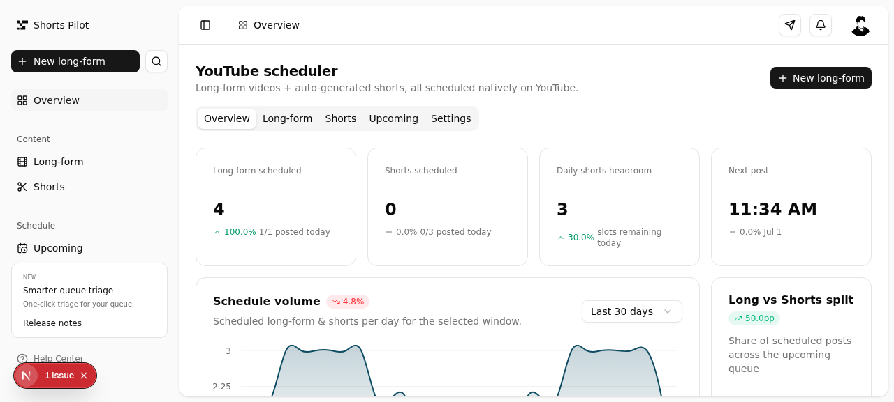

# Shorts Pilot

A self-hosted YouTube scheduler for long-form videos and AI-generated shorts.

Long-form videos are scheduled natively on YouTube (via the Data API v3
`videos.insert` + `publishAt`) with a random time inside your configurable
window. Shorts are auto-generated from the long-form transcript using a
6-beat narrative pattern (hook → rising action → conflict → comeback →
build tension → reveal), with viral-style headers, and scheduled on
YouTube with ≥2-hour spacing and configurable daily caps.

Multi-LLM support: Z.AI, Groq, Gemini, and Claude. Set one key and it
uses that provider. Set two or more and it rotates evenly across them.



---

## Quickstart

```bash
# 1. Install dependencies
bun install

# 2. Set up the database
bun run db:push

# 3. Configure your environment
cp .env.example .env
#   → fill in at least one LLM key (Z.AI, Groq, Gemini, or Claude)
#   → fill in YouTube OAuth credentials (see docs/youtube-oauth.md)
#   → or set YOUTUBE_MOCK_MODE=true for local dev without YouTube

# 4. Start the dev server
bun run dev
```

Open the preview — the app runs on port 3000.

---

## What it does

### Long-form scheduling
- Upload a long-form video (local file path or HTTP URL).
- Pick a scheduling window (default 09:00–17:00).
- The scheduler picks a random time inside that window.
- Daily cap enforced (default: 1 long-form per day, configurable).
- Video is uploaded to YouTube as **Private** with `publishAt` set — YouTube
  flips it to public automatically at the scheduled time.

### Shorts generation
- From any long-form video, click **Generate shorts**.
- The LLM reads the transcript and finds the 6 best moments using the
  narrative pattern: **hook/problem → rising-action/assess →
  conflict/isolate → comeback/process → build tension → reveal**.
- Each moment becomes a short with a viral-style header (≤60 chars).
- Shorts are auto-scheduled on YouTube with ≥2-hour spacing and a daily
  cap (default: 3 per day, configurable).
- Each short is tagged with its beat so you can see which narrative
  function it serves.

### Multi-LLM rotation
- Set one provider key → that provider handles all calls.
- Set two or more → round-robin rotation by default (`LLM_ROTATE=true`).
- Set `LLM_ROTATE=false` to always use the first configured provider.
- Provider order: Z.AI → Groq → Gemini → Claude.
- If one provider fails, the next is tried automatically.

---

## Configuration

All configuration is via `.env`. See `.env.example` for the full reference.

### LLM providers (set at least one)

| Key | Provider | Model | Where to get it |
|-----|----------|-------|-----------------|
| `ZAI_API_KEY` | Z.AI | GLM-4.6 | https://z.ai |
| `GROQ_API_KEY` | Groq | Llama 3.3 70B | https://console.groq.com |
| `GEMINI_API_KEY` | Google Gemini | 2.5 Flash | https://aistudio.google.com/apikey |
| `ANTHROPIC_API_KEY` | Anthropic Claude | Haiku 4.5 | https://console.anthropic.com |

| Key | Default | Description |
|-----|---------|-------------|
| `LLM_ROTATE` | `true` (when ≥2 keys set) | Rotate evenly across configured providers |

### YouTube Data API v3

| Key | Required | Description |
|-----|----------|-------------|
| `YOUTUBE_CLIENT_ID` | yes (live mode) | OAuth client ID from Google Cloud |
| `YOUTUBE_CLIENT_SECRET` | yes (live mode) | OAuth client secret |
| `YOUTUBE_REFRESH_TOKEN` | yes (live mode) | Long-lived refresh token |
| `YOUTUBE_MOCK_MODE` | `false` | Set to `true` to skip real uploads (local dev) |

See [`docs/youtube-oauth.md`](docs/youtube-oauth.md) for the full OAuth
setup walkthrough.

### Database

| Key | Default | Description |
|-----|---------|-------------|
| `DATABASE_URL` | `file:./db/custom.db` | SQLite path (Prisma) |

### Dashboard settings (editable in-app)

These persist to the database and can be changed in the Settings tab:

| Setting | Default | Description |
|---------|---------|-------------|
| Long-form per day | 1 | Max long-form videos scheduled per day |
| Shorts per day | 3 | Max shorts scheduled per day |
| Min spacing between shorts | 120 min | Minimum gap between any two scheduled shorts |
| Long-form window start | 09:00 | Start of the random scheduling window |
| Long-form window end | 17:00 | End of the random scheduling window |

---

## Tech stack

- **Framework**: Next.js 16 (App Router) + TypeScript 5
- **UI**: Tailwind CSS 4 + shadcn/ui (New York style) + @efferd/dashboard-3 block
- **Database**: Prisma ORM + SQLite
- **YouTube**: `googleapis` (YouTube Data API v3)
- **LLMs**: Z.AI (`z-ai-web-dev-sdk`), Groq (`openai` SDK, OpenAI-compatible), Gemini (`@google/genai`), Claude (`@anthropic-ai/sdk`)
- **State**: Zustand (client), TanStack Query (server)
- **Charts**: Recharts

---

## Project structure

```
src/
├── app/
│   ├── api/              # API routes (long-form, shorts, settings, schedule, status, seed)
│   ├── layout.tsx        # Root layout (Toaster, TooltipProvider)
│   └── page.tsx          # Single-page app entry
├── components/
│   ├── ui/               # shadcn/ui primitives
│   ├── dashboard.tsx     # Tab shell + Overview tab
│   ├── long-form-panel.tsx
│   ├── shorts-panel.tsx
│   ├── upcoming-panel.tsx
│   ├── settings-panel.tsx
│   ├── new-long-form-dialog.tsx
│   └── ... (efferd dashboard-3 components)
├── lib/
│   ├── beats.ts          # 6-beat narrative pattern (client-safe)
│   ├── llm-shared.ts     # Provider labels (client-safe)
│   ├── llm.ts            # Multi-provider LLM client with rotation
│   ├── youtube-shared.ts # URL helpers (client-safe)
│   ├── youtube.ts        # Real YouTube Data API v3 integration
│   ├── zai.ts            # Moment detection + header generation
│   ├── scheduler.ts      # Random time, daily caps, 2h spacing
│   ├── shorts-pipeline.ts # Orchestrates detect → generate → schedule
│   ├── store.ts          # Zustand store (tab state, refresh key)
│   └── db.ts             # Prisma client
└── prisma/
    └── schema.prisma     # LongFormVideo, Short, Setting models
```

See [`ARCHITECTURE.md`](ARCHITECTURE.md) for the full request lifecycle.

---

## Development

```bash
bun run dev       # Start dev server (port 3000)
bun run lint      # ESLint
bun run db:push   # Push schema changes to SQLite
bun run db:generate  # Regenerate Prisma client
```

See [`CONTRIBUTING.md`](CONTRIBUTING.md) for conventions.

---

## Reviews

This project was reviewed using the [gstack](https://github.com/garrytan/gstack)
skill chain. Review outputs are in [`docs/reviews/`](docs/reviews/):

1. [`01-plan-design-review.md`](docs/reviews/01-plan-design-review.md) — 7-pass design review
2. [`02-design-review.md`](docs/reviews/02-design-review.md) — Visual QA + fixes
3. [`03-plan-devex-review.md`](docs/reviews/03-plan-devex-review.md) — Developer experience review
4. [`04-review.md`](docs/reviews/04-review.md) — Pre-landing code review
5. [`05-qa.md`](docs/reviews/05-qa.md) — QA test results + bug fixes
6. [`06-document-generate.md`](docs/reviews/06-document-generate.md) — Documentation coverage audit
7. [`07-document-release.md`](docs/reviews/07-document-release.md) — Release notes

---

## License

MIT
