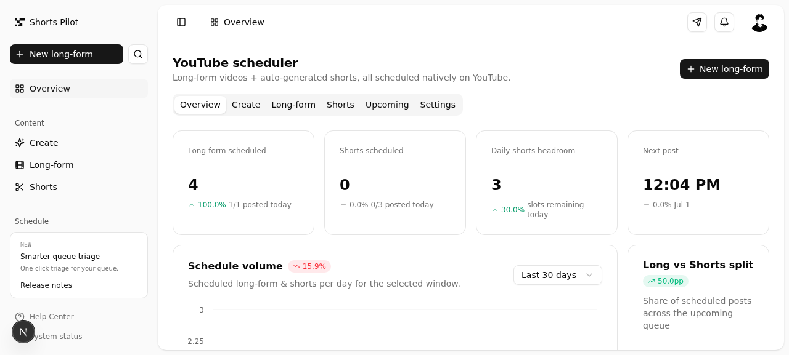

# Shorts Pilot

**The open-source YouTube scheduler for creators who want to automate long-form videos and AI-generated shorts — without giving up control of their channels.**

Self-hosted. Multi-account. Multi-LLM. Native YouTube scheduling via the Data API v3.



---

## What it does

Shorts Pilot is a YouTube automation tool that runs on your own server. It does three things:

### 1. Schedule long-form videos natively on YouTube
Upload a video, pick a scheduling window (e.g. 9 AM–5 PM), and Shorts Pilot posts it to YouTube at a random time inside that window. The video stays **Private** until the scheduled time, then YouTube flips it to public automatically. One post per day max (configurable).

### 2. Generate shorts from long-form videos with AI
Paste your transcript and the LLM finds the 6 best moments using a proven narrative pattern:

> **hook/problem → rising-action/assess → conflict/isolate → comeback/process → build tension → reveal**

Each moment becomes a short with a viral-style header (≤60 chars). The shorts are auto-scheduled on YouTube with ≥2-hour spacing and a daily cap (default 3 per day).

### 3. Rotate across multiple LLM providers
Set keys for Z.AI (GLM-4.6), Groq (Llama 3.3 70B), Gemini (2.5 Flash), and Claude (Haiku 4.5). Two or more keys = even round-robin rotation. If one provider fails, the next is tried automatically. Override the default model for any provider with a single env var.

---

## Why creators use it

- **Self-hosted** — your videos, transcripts, and API keys never leave your server. No SaaS middleman.
- **Multi-account** — connect multiple YouTube channels. Each gets a distinct color so you never accidentally post to the wrong channel.
- **One-click Google login** — click "Add YouTube account", log in to Google, done. No manual OAuth token copy/paste.
- **Real uploads with progress bars** — drag and drop your MP4. Watch the upload progress in real time.
- **Native YouTube scheduling** — videos are scheduled via `videos.insert` + `publishAt`. They go live automatically at the scheduled time, even if your server is off.
- **6-beat narrative pattern** — the shorts moment detector uses a storytelling framework (hook → rising → conflict → comeback → tension → reveal) that's proven to retain viewers.
- **Multi-LLM rotation** — don't depend on one provider. Rotate across Z.AI, Groq, Gemini, and Claude for cost optimization and redundancy.
- **Configurable limits** — change the daily caps, scheduling window, and upload limit from the dashboard. No code edits.

---

## Quickstart

```bash
# 1. Install dependencies (npm required)
npm install

# 2. Set up the database
npm run db:push

# 3. Configure your environment
cp .env.example .env
#   → fill in at least one LLM key (Z.AI, Groq, Gemini, or Claude)
#   → fill in YouTube OAuth credentials (see docs/youtube-oauth.md)
#   → or set YOUTUBE_MOCK_MODE=true for local dev without YouTube

# 4. Start the dev server
npm run dev
```

Open `http://localhost:3000` — the app runs on port 3000.

### Connect a YouTube account

1. Go to the **Settings** tab → **YouTube accounts** card.
2. If OAuth isn't configured yet, a **4-step setup wizard** appears:
   - Click the link to open Google Cloud Console
   - Enable the YouTube Data API v3
   - Create an OAuth client ID (Web application type)
   - Copy the redirect URI from the wizard into Google Cloud
   - Paste your Client ID + Client Secret into the wizard and click **Save**
3. Once saved, click **Connect with Google**.
4. You'll be redirected to Google's OAuth consent screen — log in and grant the `youtube.upload` scope.
5. Google redirects back — your channel is stored with a distinct color.
6. Repeat for additional channels.

No `.env` editing required — the credentials are stored in the app's database. See [`docs/youtube-oauth.md`](docs/youtube-oauth.md) for details.

### Upload your first long-form video

1. Go to the **Create** tab.
2. Select **Long-form video** mode.
3. Drag and drop your MP4/MOV/WebM file.
4. Fill in the title, description, and transcript.
5. Pick the scheduling window (default 09:00–17:00).
6. Select the YouTube account (the colored banner confirms which channel you're posting to).
7. Click **Schedule on YouTube**.

The video uploads to YouTube as **Private** with `publishAt` set to a random time inside your window. YouTube publishes it automatically.

### Generate shorts

1. Go to the **Create** tab.
2. Select **Shorts** mode.
3. Pick a long-form video from the list.
4. Click **Generate shorts**.
5. Watch the multi-step progress: load → detect moments → generate headers → find slots → upload to YouTube.

You'll get up to 6 shorts (one per narrative beat), each with a viral header, scheduled with ≥2-hour spacing.

---

## Configuration

All configuration is via `.env`. See `.env.example` for the full reference.

### LLM providers (set at least one)

| Key | Provider | Default model | Where to get a key |
|-----|----------|---------------|--------------------|
| `ZAI_API_KEY` | Z.AI | `glm-4.6` | https://z.ai |
| `GROQ_API_KEY` | Groq | `llama-3.3-70b-versatile` | https://console.groq.com |
| `GEMINI_API_KEY` | Google Gemini | `gemini-2.5-flash` | https://aistudio.google.com/apikey |
| `ANTHROPIC_API_KEY` | Anthropic Claude | `claude-haiku-4.5` | https://console.anthropic.com |

**Override the default model** for any provider:

| Key | Default | Example override |
|-----|---------|------------------|
| `ZAI_MODEL` | `glm-4.6` | `glm-4.5` |
| `GROQ_MODEL` | `llama-3.3-70b-versatile` | `llama-3.1-8b-instant` |
| `GEMINI_MODEL` | `gemini-2.5-flash` | `gemini-2.5-pro` |
| `ANTHROPIC_MODEL` | `claude-haiku-4.5` | `claude-sonnet-4.5` |

**Rotation**:

| Key | Default | Description |
|-----|---------|-------------|
| `LLM_ROTATE` | `true` (when ≥2 keys set) | Rotate evenly across configured providers |

### YouTube OAuth

| Key | Required | Description |
|-----|----------|-------------|
| `YOUTUBE_CLIENT_ID` | yes | OAuth client ID from Google Cloud |
| `YOUTUBE_CLIENT_SECRET` | yes | OAuth client secret |
| `YOUTUBE_REDIRECT_URI` | yes | Must match your Google Cloud config (default `http://localhost:3000/api/youtube/callback`) |
| `YOUTUBE_MOCK_MODE` | `false` | Set to `true` to skip real uploads (local dev) |

See [`docs/youtube-oauth.md`](docs/youtube-oauth.md) for the full OAuth setup walkthrough.

### Uploads

| Key | Default | Description |
|-----|---------|-------------|
| `UPLOAD_MAX_SIZE_MB` | `2048` | Max file size for video uploads (also configurable in dashboard) |

### Dashboard settings (editable in-app)

| Setting | Default | Description |
|---------|---------|-------------|
| Long-form per day | 1 | Max long-form videos scheduled per day |
| Shorts per day | 3 | Max shorts scheduled per day |
| Min spacing between shorts | 120 min | Minimum gap between any two scheduled shorts |
| Long-form window start | 09:00 | Start of the random scheduling window |
| Long-form window end | 17:00 | End of the random scheduling window |
| Upload limit | 2048 MB | Max file size for uploads |

---

## Tech stack

- **Framework**: Next.js 16 (App Router) + TypeScript 5
- **Package manager**: npm
- **UI**: Tailwind CSS 4 + shadcn/ui (New York style) + @efferd/dashboard-3 block
- **Database**: Prisma ORM + SQLite
- **YouTube**: `googleapis` (YouTube Data API v3 — `videos.insert` + `publishAt`)
- **LLMs**: Z.AI (`z-ai-web-dev-sdk`), Groq (`openai` SDK, OpenAI-compatible), Gemini (`@google/genai`), Claude (`@anthropic-ai/sdk`)
- **State**: Zustand (client), TanStack Query (server)
- **Charts**: Recharts

---

## Project structure

```
src/
├── app/
│   ├── api/              # API routes (upload, long-form, shorts, youtube/auth, youtube/callback, youtube/accounts, settings, schedule, status, seed)
│   ├── layout.tsx        # Root layout (Toaster, TooltipProvider)
│   └── page.tsx          # Single-page app entry (Dashboard loaded with ssr:false)
├── components/
│   ├── ui/               # shadcn/ui primitives
│   ├── dashboard.tsx     # Tab shell (Overview, Create, Long-form, Shorts, Upcoming, Settings)
│   ├── create-panel.tsx  # Create wizard (upload + generate shorts)
│   ├── file-uploader.tsx # Drag-and-drop uploader with progress bar
│   ├── youtube-account-selector.tsx  # Colored account selector
│   ├── step-progress.tsx # Multi-step progress indicator
│   ├── long-form-panel.tsx
│   ├── shorts-panel.tsx
│   ├── upcoming-panel.tsx
│   ├── settings-panel.tsx
│   └── ... (efferd dashboard-3 components)
├── lib/
│   ├── beats.ts          # 6-beat narrative pattern (client-safe)
│   ├── llm-shared.ts     # Provider labels + model defaults (client-safe)
│   ├── llm.ts            # Multi-provider LLM client with rotation + dynamic imports
│   ├── youtube-shared.ts # URL helpers (client-safe)
│   ├── youtube.ts        # Real YouTube Data API v3 + multi-account OAuth
│   ├── zai.ts            # Moment detection + header generation
│   ├── scheduler.ts      # Random time, daily caps, 2h spacing
│   ├── shorts-pipeline.ts # Orchestrates detect → generate → schedule
│   ├── store.ts          # Zustand store (tab state, refresh key)
│   └── db.ts             # Prisma client
└── prisma/
    └── schema.prisma     # LongFormVideo, Short, YouTubeAccount, Setting models
```

See [`ARCHITECTURE.md`](ARCHITECTURE.md) for the full request lifecycle.

---

## Development

```bash
npm install       # Install dependencies
npm run dev       # Start dev server (port 3000)
npm run lint      # ESLint
npm run db:push   # Push schema changes to SQLite
npm run db:generate  # Regenerate Prisma client
```

See [`CONTRIBUTING.md`](CONTRIBUTING.md) for conventions.

---

## Reviews

This project is reviewed using the [gstack](https://github.com/garrytan/gstack) skill chain. Review outputs are in [`docs/reviews/`](docs/reviews/):

1. [`01-plan-design-review.md`](docs/reviews/01-plan-design-review.md) — 7-pass design review
2. [`02-design-review.md`](docs/reviews/02-design-review.md) — Visual QA
3. [`03-plan-devex-review.md`](docs/reviews/03-plan-devex-review.md) — Developer experience review
4. [`04-review.md`](docs/reviews/04-review.md) — Pre-landing code review
5. [`05-qa.md`](docs/reviews/05-qa.md) — QA test results
6. [`06-document-release.md`](docs/reviews/06-document-release.md) — Release notes

---

## Use cases

### For YouTubers with multiple channels
Connect all your channels. Each gets a color. When you schedule a video, the colored banner confirms which channel you're posting to. Never accidentally post your gaming video to your cooking channel again.

### For content repurposers
Upload a 30-minute long-form video, paste the transcript, click "Generate shorts". Get 6 shorts with viral headers, each tagged with its narrative beat (hook, conflict, reveal, etc.). All scheduled with 2-hour spacing.

### For agencies
Connect client channels. Schedule a week of content in one sitting. The daily caps and 2-hour spacing prevent YouTube's algorithm from flagging you as spammy.

### For developers
Self-host on a $5 VPS. SQLite means no database server. Dynamic SDK imports keep memory usage low. Override any LLM model via env vars. Add your own provider by following the pattern in `src/lib/llm.ts`.

---

## Troubleshooting (Windows)

### `EPERM: operation not permitted, rmdir` during `npm install`

A file in `node_modules` is locked by another process. Fix:

```powershell
# 1. Kill any node processes
taskkill /f /im node.exe

# 2. Close VS Code completely (it locks files in node_modules)

# 3. Delete node_modules using rimraf (Windows rmdir is flaky with deep trees)
npx rimraf node_modules package-lock.json

# 4. Reinstall
npm install
```

If `npx rimraf` fails too, open a **Command Prompt as Administrator** and run `rmdir /s /q node_modules`.

### `ECONNRESET` on `@prisma/engines` postinstall

The Prisma engine binary download was interrupted. This is a network issue — retry:

```powershell
# Option A: just retry
npm install

# Option B: use the Prisma binary mirror (more reliable)
set PRISMA_ENGINES_MIRROR=https://binaries.prisma.sh
npm install

# Option C: if behind a corporate proxy
set HTTPS_PROXY=http://your-proxy:port
npm install
```

### `Prisma Client not found` after pulling

The `predev` hook should handle this automatically, but if it doesn't:

```powershell
npm run db:generate
npm run dev
```

### Port 3000 already in use

```powershell
# Find and kill the process using port 3000
netstat -ano | findstr :3000
taskkill /f /pid <PID>
```

---

## FAQ

**Does this violate YouTube's Terms of Service?**
No. Shorts Pilot uses the official YouTube Data API v3 with the `youtube.upload` scope. Videos are uploaded via `videos.insert` with `publishAt` — this is the same API that Hootsuite, Buffer, and every other legitimate scheduling tool uses.

**Will YouTube shadowban me for scheduling?**
No. Scheduled uploads via the API are indistinguishable from manual uploads. The `publishAt` field is a first-class YouTube feature.

**Can I use this without any LLM keys?**
Yes — the app falls back to a deterministic transcript splitter that segments the video into 6 equal parts. The headers won't be as catchy, but the workflow works.

**Can I use this without YouTube OAuth?**
Yes — set `YOUTUBE_MOCK_MODE=true` in `.env`. The app will return fake video IDs without uploading. Useful for testing the UI.

**How much does it cost to run?**
The app itself is free and open source. Your costs are: (1) a server to run it on (a $5 VPS is plenty), (2) LLM API calls (Groq has a free tier; Z.AI and Gemini are cheap; Claude is mid-range), (3) YouTube API quota (10,000 units/day free, each upload costs ~1600 units).

---

## License

MIT
